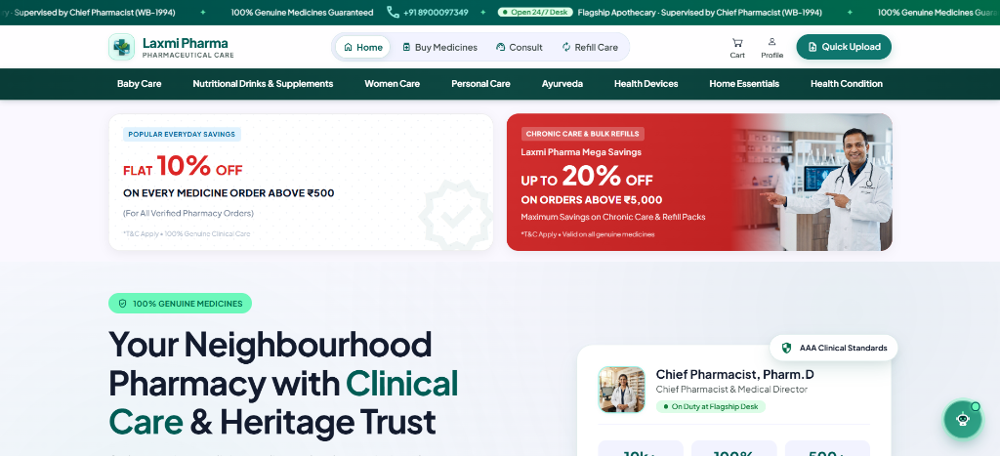
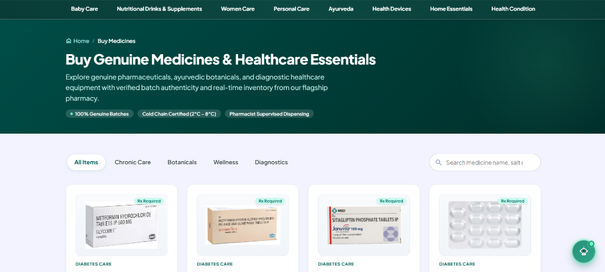
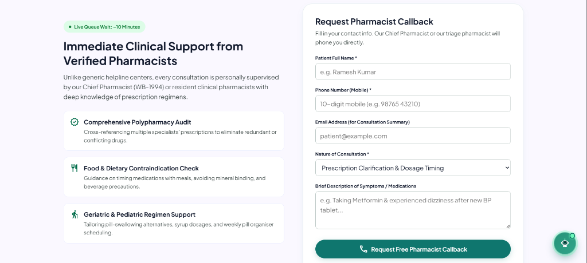
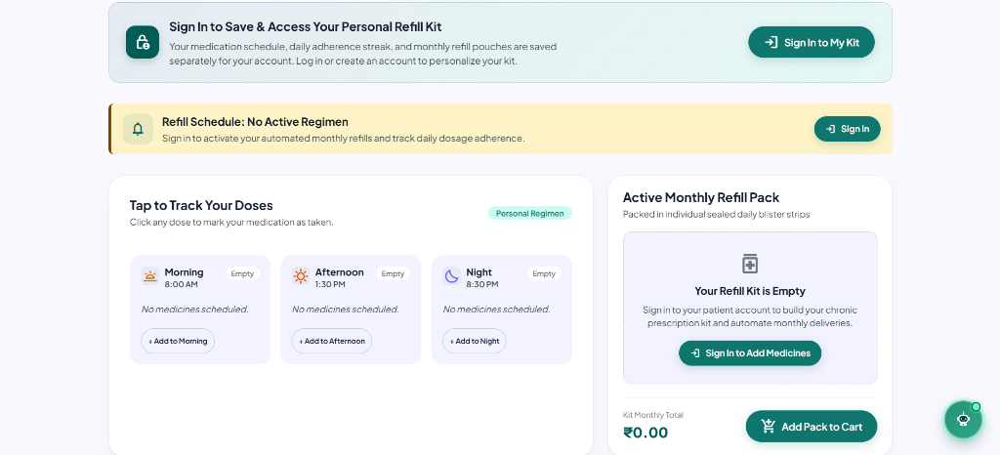
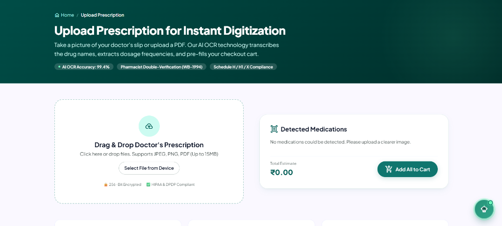

# Laxmi Pharma 🌿💊

> **A full-featured digital pharmacy and clinical care platform built for neighbourhood apothecaries. Laxmi Pharma allows patients to browse genuine medicines, manage chronic refill schedules, consult certified pharmacists, upload prescriptions, and chat with an AI-powered health assistant.**

[](https://github.com/sandip07102004/laxmi-pharma/raw/main/Laxmi-Pharma.apk)
[](https://github.com/sandip07102004/laxmi-pharma)
[](https://developer.mozilla.org/en-US/docs/Web/JavaScript)
[](https://firebase.google.com)
[](https://supabase.com)

---

## 📱 Mobile Application (Android)

Laxmi Pharma is packaged as a high-performance native Android application using **Capacitor**:

* **📥 Direct APK Download:** [**Download Laxmi-Pharma.apk (Latest v1.0)**](https://github.com/sandip07102004/laxmi-pharma/raw/main/Laxmi-Pharma.apk)
* **💊 Comprehensive Care on Mobile:** Access the complete medicine store, chronic refill schedule, pharmacist tele-consultation desk, and clinical AI assistant directly on your mobile device.
* **⚡ Native Mobile Experience:** Custom Laxmi Pharma splash launch screen, clean white status bar with crisp dark system icons, and intelligent hardware Back button gesture navigation.

---

## 📸 Platform Previews

<div align="center">

### 1. Flagship Apothecary & Clinical Homepage


<br/><br/>

### 2. Genuine Medicine Store & Inventory


<br/><br/>

### 3. Pharmacist Consultation Desk


<br/><br/>

### 4. Chronic Care Refill Management


<br/><br/>

### 5. Prescription Upload & OCR Digitization


</div>

---

## 🚀 Key Features

* **🛒 Medicine Store & Cart:** Real-time stock search, category filters, and an interactive slide-out cart.
* **🔁 Chronic Care Refill Stepper:** Patient adherence tracker for Morning, Noon, and Night schedules with renewal alerts.
* **👨‍⚕️ Pharmacist Consult Desk:** Instant appointment booking and triage desk supervised by accredited pharmacists.
* **📄 Prescription Upload & OCR Scanner:** Drag-and-drop prescription submission for rapid pharmacist verification.
* **🤖 AI Health Assistant:** Clinical conversational assistant answering medication timings, drug interactions, and dietary guidance.
* **🔐 Supabase Authentication:** Passwordless Email OTP authentication for customer accounts.

---

## 🎨 Design System: "Clinical Botanics"

* **Primary Palette:** Deep Emerald Teal (`#005c55` / `#0f766e`) & Sage Green (`#10b981`)
* **Warm Accents:** Amber & Gold (`#d97706` / `#ffdcc3`)
* **Typography:** [Plus Jakarta Sans](https://fonts.google.com/specimen/Plus+Jakarta+Sans) & Google Material Symbols
* **Shape Language:** Smooth pill-shaped micro-interactions, clean glass cards, and responsive fluid layout.

---

## 🛠️ Tech Stack

* **Frontend:** HTML5, Modern CSS3 (CSS Variables, Flexbox, Grid), Vanilla JavaScript (ES6+)
* **Mobile Runtime:** Capacitor 7 for Android Native Runtime
* **Backend:** Node.js, Express.js
* **Authentication & Database:** Supabase (Auth & Postgres)
* **Email Service:** Resend SMTP / API
* **Hosting:** Firebase Hosting

---

## 💻 Local Setup & Development

### 1. Clone the repository:
```bash
git clone https://github.com/sandip07102004/laxmi-pharma.git
cd laxmi-pharma
```

### 2. Environment Variables:
Copy the example environment configuration:
```bash
cp .env.example .env
```
Fill in your own Supabase credentials and Resend API keys.

### 3. Run the Backend Server:
```bash
cd server
npm install
npm start
```
The server will run on `http://localhost:5000`.

### 4. Deploy to Firebase:
```bash
npx firebase-tools deploy --only hosting
```

---

## 📄 License
This project is open-source and available under the [MIT License](LICENSE).
